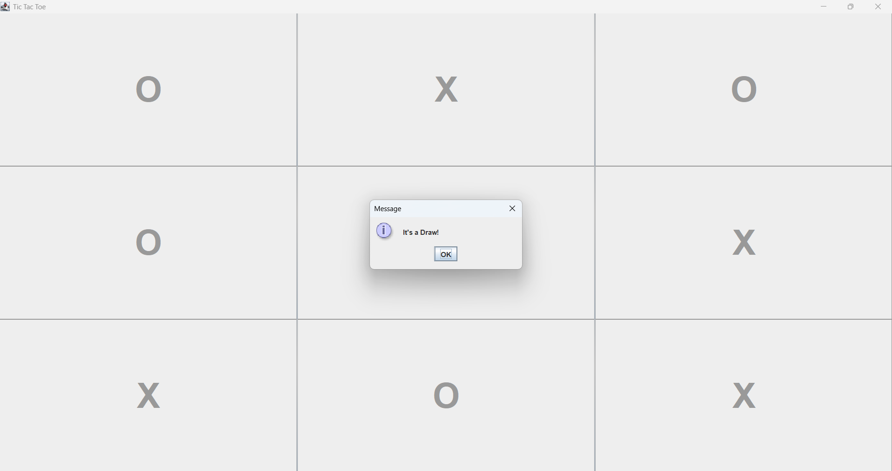
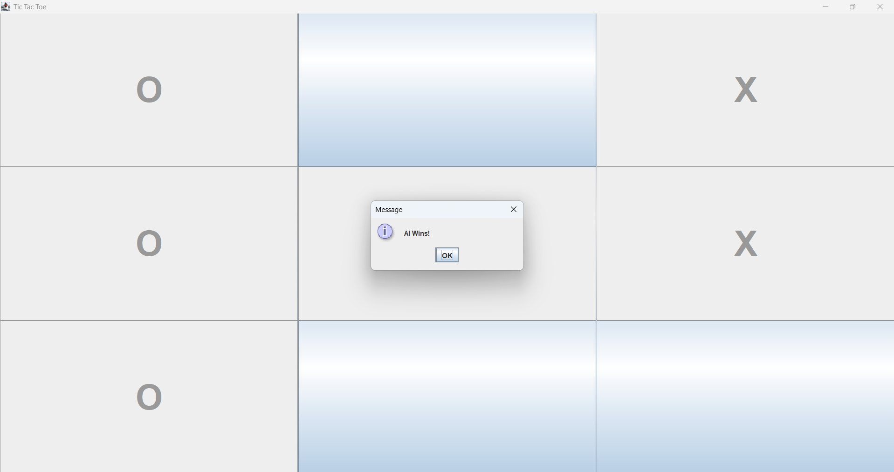

# TicTacToeGUI 🎮

A Java-based GUI Tic-Tac-Toe game built using **Swing Framework** with an implementation of the **Minimax Algorithm** and **Alpha-Beta Pruning** for AI decision-making.

## 🛠️ Technologies Used
- **Java**
- **Swing (Java GUI Library)**
- **AI: Minimax Algorithm with Alpha-Beta Pruning**

## 📌 Features
- Interactive 3x3 Tic-Tac-Toe game board
- Player vs Computer mode
- AI opponent uses optimal strategy with Minimax + Alpha-Beta Pruning
- Intuitive and responsive GUI
- Automatic game result detection (Win/Draw)

## 🧠 AI Logic
The AI evaluates the game tree using the **Minimax Algorithm**, enhanced with **Alpha-Beta Pruning** to improve efficiency by pruning unnecessary branches in the decision tree. This ensures the best move is chosen while reducing computational time.

## 📸 Screenshots

INTERMEDIATE PLAYING STATE:

_PLAYER(X).png)

STATE SHOWING A MATCH DRAW:



STATE SHOWING AI WINING POSITION:



## 🚀 How to Run
1. Clone the repository:
   ```bash
   git clone https://github.com/Karishma-156/TicTacToeGUI.git

2. Compile and run the Java file:
   ```bash
   javac TicTacToe.java
   java TicTacToe


